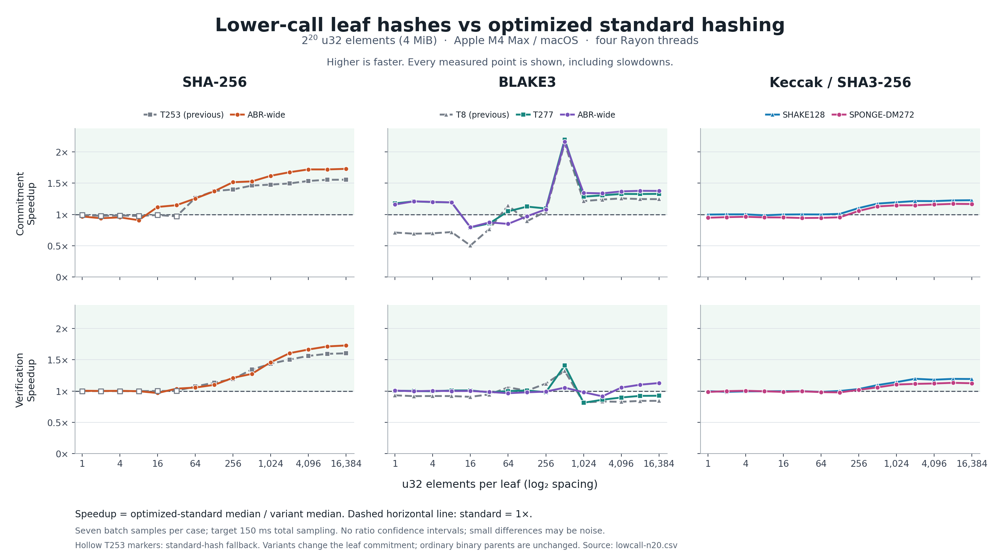
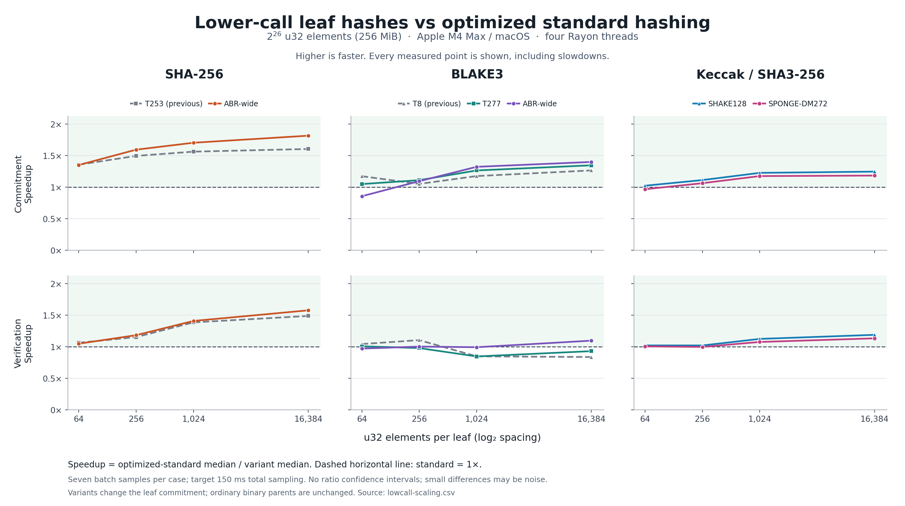

# Implemented low-call leaf hashes

The selected constructions are implemented, optimized, and measured against
`OptimizedMerkleTree` with `LeafMode::Standard` from the **same executable**.
At 256 MiB and 64 KiB per leaf, SHA-256 ABR-wide improves commitment by 1.82×
and verification by 1.58×. BLAKE3 ABR-wide improves them by 1.40× and 1.10×.
SHAKE128 improves them by 1.25× and 1.19×; SPONGE-DM272 by 1.18× and 1.13×.
These gains are specific to the measured machine and geometry. Small records
do not consistently improve, and BLAKE3 T277 verification remains slower at
large widths despite its commitment gain.

## Selected modes and native counts

All modes hash complete fixed-width records to 32-byte digests. The binary
upper tree is unchanged. Explicit mode selection changes the root; all older
modes retain their existing roots. Public byte and u32 APIs, recommit, and
ordinary whole-leaf proofs support the new modes.

| Backend | New Rust mode | First / later fresh bytes per gadget | Useful native calls at 64 KiB | Standard calls | Reduction |
|---|---|---:|---:|---:|---:|
| SHA-256 | `AbrWide` | 569 / 537, seven calls | 854 | 1,025 | 16.7% |
| BLAKE3 | `AbrWide` | 625 / 593, seven calls | 774 | 1,087 | 28.8% |
| BLAKE3 | `T277` | 277 / 245, three calls | 803 | 1,087 | 26.1% |
| Keccak | `Shake128` | 168-byte rate | 391 | 482 | 18.9% |
| Keccak | `SpongeDm272` | 166-byte rate, 17-byte prefix | 395 | 482 | 18.0% |

`AbrWide` uses a 95-byte SHA-256 compression input or a 103-byte BLAKE3
compression input. A constant-time-in-width planner minimizes calls over
MD-only, complete-gadget-plus-MD-tail, and final-padded-gadget schedules. It
breaks ties by least padding, then most gadgets. The new MD roles are disjoint
from the gadget roles. Small leaves can use the restricted MD path directly.
The code does not choose a different hash based on machine performance.

SHAKE128 is the exact standardized XOF with a 32-byte output. SPONGE-DM272
uses full-round Keccak-f[1600], capacity 272 bits, and full-state feed-forward.
Both retain SHA3-256 binary parents. T520 remains an analytical candidate:
its proposed joint-role composition argument is unfinished. Exact encodings,
padding, roles, and stage ordering are specified in [EXPERIMENTS.md](EXPERIMENTS.md).

Counts are logical useful compression calls (SHA-256/BLAKE3) or full 24-round
permutations (Keccak), not equal units of CPU work. With L leaves and c calls
per leaf, commitment costs `L*c + L - 1`; verification costs `c + log2(L)`.
Partly occupied SIMD windows can repeat inputs. For a 64 KiB BLAKE3 leaf,
single verification runs 786 compression lanes for ABR-wide's 774 useful
calls and 807 lanes for T277's 803. Four-record commitment uses every lane.
The CSV reports useful calls, including the ordinary parents.

## Measured results

Apple M4 Max (16 cores, 64 GiB), arm64 macOS, Rust 1.96.0, four Rayon threads
for commitment. Each entry is the median of seven calibrated batch samples,
targeting 150 ms total sampling per case. Verification is a single complete
leaf opening, including its binary path. Speedup is standard time divided by
variant time; values below 1× are slower.

The following table uses **2^26 u32 elements (256 MiB), 2^14 elements per leaf
(64 KiB), 4,096 leaves**. Each backend's standard row is its own comparator.

| Backend | Mode | Commit ms | Speedup | Verify µs | Speedup |
|---|---|---:|---:|---:|---:|
| SHA-256 | Standard | 25.959 | 1.00× | 22.541 | 1.00× |
| SHA-256 | Previous T253 | 16.177 | 1.60× | 15.154 | 1.49× |
| SHA-256 | **ABR-wide** | **14.300** | **1.82×** | **14.300** | **1.58×** |
| BLAKE3 | Standard | 28.842 | 1.00× | 27.956 | 1.00× |
| BLAKE3 | Previous T8 | 22.801 | 1.26× | 33.408 | 0.84× |
| BLAKE3 | **ABR-wide** | **20.611** | **1.40×** | **25.510** | **1.10×** |
| BLAKE3 | T277 | 21.433 | 1.35× | 30.073 | 0.93× |
| Keccak | Standard SHA3-256 | 34.635 | 1.00× | 65.955 | 1.00× |
| Keccak | **SHAKE128** | **27.798** | **1.25×** | **55.520** | **1.19×** |
| Keccak | SPONGE-DM272 | 29.274 | 1.18× | 58.245 | 1.13× |

At this geometry, ABR-wide also improves on the previous SHA-256 T253 by
1.13× for commitment and 1.06× for verification, and on BLAKE3 T8 by 1.11×
and 1.31× respectively. T277 remains useful as a smaller, generalized-T
comparison, but is not the fastest large-leaf option here.





The sweep records **460 timings**: every power-of-two width from 1 to 16,384
u32 elements at N=2^20, plus widths 64, 256, 1,024 and 16,384 at N=2^24 and
N=2^26. It is not a full Cartesian sweep of all matrix sizes and widths.
[Plot tables, SVGs, and 322 exact ratios](results/lowcall-plots/README.md)
include every measured case, including regressions.

The small-width results matter. At N=2^20 and 16 elements per leaf, BLAKE3
ABR-wide commitment is 0.80× standard despite using the same useful leaf-call
count. At 64 elements, it is 0.85×. Restricted input packing and scheduling
can outweigh call savings; standard BLAKE3 has efficient fixed-CV batching.
For Keccak, short leaves often use the same number of permutations, so SHAKE
is essentially tied and SPONGE-DM's feed-forward adds overhead. Binary-parent
work also dilutes leaf savings for narrow records.

The N=2^20 BLAKE3 commitment spike near 512 elements per leaf comes from a
baseline performance discontinuity: the standard implementation batches
records up to 1 KiB, then hashes each larger record through upstream BLAKE3.
At 2 KiB, there are too few chunks to fill a four-lane within-record batch;
4 KiB records fill it. The figure includes this measured behavior, but the
headline comparison uses 64 KiB leaves rather than this favorable local peak.

## Optimizations performed

- **SHA-256:** fused seven-call ABR kernels load 95-byte inputs directly,
  retain intermediates and chaining states in native vector registers, and
  interleave independent SHA2 instructions. Two-record commitment also pairs
  roots and MD tails. Single verification pairs the independent bottom and
  middle calls before its serial root.
- **BLAKE3:** fused four-record NEON kernels pack message, variable CV, and
  seven payload counter bytes directly. Both ABR-wide and T277 retain states
  across gadgets and tails. Single verification prepares independent branches
  for four stages at a time, then finishes the serial roots in order.
- **Keccak:** scalar and two-record permutation states persist across all
  absorbed blocks. Dispatch occurs once per leaf/batch; word-wise packing
  handles the 166-byte SPONGE-DM rate without byte-wise full-block loops.
- **Shared machinery:** no per-leaf heap allocation, bounded scratch, an O(1)
  public-width planner, and existing coarse Rayon jobs with serial upper levels.
  Native kernels have runtime CPU checks and portable fallbacks.

The intermediate timing data show why native-call counts alone were not
enough. At N=2^20 and 64 KiB leaves, initial SHA-256 ABR-wide took 0.526 ms
to commit and 30.995 µs to verify. After fusion the tuning run took 0.243 ms
and 12.908 µs. BLAKE3 ABR-wide verification fell from 37.606 to 22.699 µs,
and T277 from 45.831 to 27.145 µs. These are separate tuning runs, with their
own contemporaneous standard baselines; small differences should not be read
as precise causal estimates. The primary tables use only the final sweeps.

## Validation and reproducibility

Passed the full test suite with and without the default parallel feature:
76 tests and one doctest in each configuration. Formatting and all-target,
all-feature Clippy passed with warnings denied. An additional forced software
Keccak run passed 62 relevant unit/integration tests. The
[validation log](results/lowcall-validation.txt) records commands and output.

Tests cover independent scalar/specification references, SHAKE agreement with
the `sha3` crate's SHAKE128 implementation, full-state SPONGE-DM agreement with a
byte-wise reference, planner agreement with exhaustive schedules, and all 75
new-mode count entries in the independent analytical CSV. They exercise
padding and schedule boundaries, maximum benchmark widths, odd batches,
native SIMD agreement, incompatible backend rejection, huge-width empty
batches, u32/byte equivalence, recommit, and tampered leaves, paths and roots.
The tested native architecture is AArch64; this does not claim an x86 runtime
test or a cryptographic audit.

Fresh commitment includes tree allocation and destruction. Matrix creation,
query/proof preparation and timing calibration are outside measured batches.
Backends run sequentially; no benchmark overlaps a build or test run. Cases
have fixed order, and p10/p90 describe batch measurements, not confidence
intervals. Small ratios near 1× can be noise. No CPU affinity, frequency lock,
or cross-machine measurements are claimed.

```sh
cargo build --release --locked --offline --manifest-path impl/Cargo.toml --example perf_sweep
python3 impl/scripts/run_lowcall.py --output lowcall-n20 \
  --cpu-model 'Apple M4 Max; 16 cores; 64 GiB RAM'
python3 impl/scripts/run_lowcall.py --output lowcall-scaling \
  --total-logs 24,26 --width-logs 6,8,10,14 \
  --cpu-model 'Apple M4 Max; 16 cores; 64 GiB RAM'
uv run impl/scripts/plot_lowcall.py
```

The runner saves the exact environment and commands, UTC interval, platform,
compiler version, source-file hashes, Git base revision and executable hash.
It rejects a source or binary change during the sweep. Git revision alone
does not identify the uncommitted source; use the recorded file hashes.

- Final [N20 CSV](results/lowcall-n20.csv) and [provenance](results/lowcall-n20.json).
- Final [N24/N26 CSV](results/lowcall-scaling.csv) and [provenance](results/lowcall-scaling.json).
- Initial tuning [CSV](results/lowcall-tuning-initial.csv) / [provenance](results/lowcall-tuning-initial.json).
- Fused tuning [CSV](results/lowcall-tuning-fused.csv) / [provenance](results/lowcall-tuning-fused.json).

## Security scope

The security levels of these choices differ. SHAKE128/32-byte output targets
128-bit classical collision and preimage security. SPONGE-DM272 has published
generic ideal-permutation exponents of 128/256/256 for collisions/preimages/
second preimages over our leaf-size range. Applying that result to concrete
Keccak is an additional assumption.

The widened ABR reduction is a provisional, unreviewed classical
ideal-function argument. T277 instantiates the generalized-T framework using
raw BLAKE3 compression with variable CVs and counters; that adapter and its
composition require additional assumptions and review. Ordinary collision
resistance of the underlying compressor alone is insufficient for T or ABR.
Previous T253 also has an overlapping unrestricted MD-tail domain. Correctness
tests and faster timings do not resolve those proof questions. See the
[security analysis and primary sources](NEXT_CONSTRUCTIONS.md).
