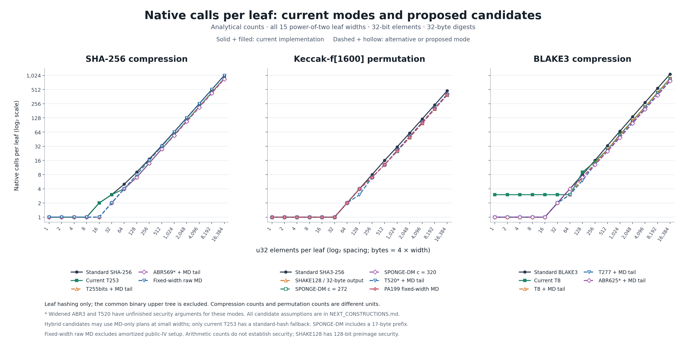
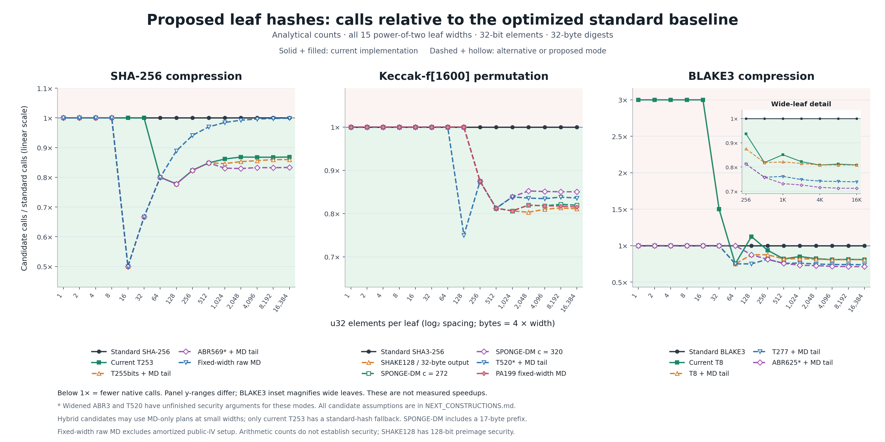

# Native calls for proposed leaf-hash candidates

Exact analytical counts at all 15 power-of-two widths from 1 to 16,384
u32 elements (4 bytes to 64 KiB per leaf), with 32-byte digests.
These are not timings, implemented new modes, or security certifications.

Solid lines and filled markers are current modes. Dashed lines and hollow
markers are alternatives or proposals; SHAKE128 is standardized, while
the other candidate parameterizations are research modes. In particular,
widened ABR3 and T520, marked `*`, have unfinished security arguments
for the proposed modes; widened ABR3 has a provisional new reduction.

The ratio is candidate calls / standard calls. Below 1 means fewer calls.
The relative plot uses linear y axes with different panel ranges; its
BLAKE3 inset magnifies large widths while preserving the three-call
small-leaf cost of current T8 on the main axis. Cross-backend count ratios
do not compare execution time. SIMD and parallelism do not change counts.

## Scope and counting conventions

- SHA-256 and BLAKE3 count native compression invocations; Keccak counts
  full Keccak-f[1600] permutations, including the sponge padding block.
- T/ABR hybrids minimize calls among a direct MD head followed by MD
  tails, full gadgets followed by MD tails, and a padded final gadget.
  The public leaf width chooses the plan. Small widths may use an MD-only
  plan; no candidate silently falls back to standard hashing.
- Current SHA-256 T253 does retain its existing standard fallback below
  253 bytes. Current BLAKE3 T8 always uses full, possibly padded gadgets.
- SPONGE-DM includes a 17-byte prefix. SHAKE128 uses its standard suffix
  and no message prefix; all outputs are 32 bytes.
- Fixed-width raw SHA-256 MD counts online message-block calls and
  excludes the amortized precomputation of a public IV for the trusted
  domain and width. PA199 uses a fixed initial state and 167 fresh bytes
  per call, with one input byte reserved for domain separation.
- All proposals require fixed trusted geometry and a complete domain
  specification. Their security assumptions differ: see the research note.
- Zero-call injective short-leaf encodings and higher-arity parent trees
  are excluded because they change the interface or upper-tree structure.

For L leaves and an unchanged one-call binary parent, total commitment
calls are `L * leaf_calls + L - 1`; one whole-leaf verification uses
`leaf_calls + log2(L)`. Only leaf calls are plotted.

- [Complete source CSV](../candidate-compression-counts.csv)
- [Research note and security assumptions](../../NEXT_CONSTRUCTIONS.md)
- [Absolute counts, SVG](native-calls.svg)
- [Relative counts, SVG](relative-calls.svg)

## Exact counts at every plotted width

### SHA-256 compression

| u32 / leaf | Bytes / leaf | Standard SHA-256 | Current T253 | T255bits + MD tail | ABR569* + MD tail | Fixed-width raw MD |
| ---: | ---: | ---: | ---: | ---: | ---: | ---: |
| 1 | 4 | 1 | 1 | 1 | 1 | 1 |
| 2 | 8 | 1 | 1 | 1 | 1 | 1 |
| 4 | 16 | 1 | 1 | 1 | 1 | 1 |
| 8 | 32 | 1 | 1 | 1 | 1 | 1 |
| 16 | 64 | 2 | 2 | 1 | 1 | 1 |
| 32 | 128 | 3 | 3 | 2 | 2 | 2 |
| 64 | 256 | 5 | 4 | 4 | 4 | 4 |
| 128 | 512 | 9 | 7 | 7 | 7 | 8 |
| 256 | 1,024 | 17 | 14 | 14 | 14 | 16 |
| 512 | 2,048 | 33 | 28 | 28 | 28 | 32 |
| 1,024 | 4,096 | 65 | 56 | 55 | 54 | 64 |
| 2,048 | 8,192 | 129 | 112 | 110 | 107 | 128 |
| 4,096 | 16,384 | 257 | 223 | 220 | 214 | 256 |
| 8,192 | 32,768 | 513 | 445 | 441 | 427 | 512 |
| 16,384 | 65,536 | 1,025 | 890 | 881 | 854 | 1,024 |

### Keccak-f[1600] permutation

| u32 / leaf | Bytes / leaf | Standard SHA3-256 | SHAKE128 / 32-byte output | SPONGE-DM c = 272 | SPONGE-DM c = 320 | T520* + MD tail | PA199 fixed-width MD |
| ---: | ---: | ---: | ---: | ---: | ---: | ---: | ---: |
| 1 | 4 | 1 | 1 | 1 | 1 | 1 | 1 |
| 2 | 8 | 1 | 1 | 1 | 1 | 1 | 1 |
| 4 | 16 | 1 | 1 | 1 | 1 | 1 | 1 |
| 8 | 32 | 1 | 1 | 1 | 1 | 1 | 1 |
| 16 | 64 | 1 | 1 | 1 | 1 | 1 | 1 |
| 32 | 128 | 1 | 1 | 1 | 1 | 1 | 1 |
| 64 | 256 | 2 | 2 | 2 | 2 | 2 | 2 |
| 128 | 512 | 4 | 4 | 4 | 4 | 3 | 4 |
| 256 | 1,024 | 8 | 7 | 7 | 7 | 7 | 7 |
| 512 | 2,048 | 16 | 13 | 13 | 13 | 13 | 13 |
| 1,024 | 4,096 | 31 | 25 | 25 | 26 | 26 | 25 |
| 2,048 | 8,192 | 61 | 49 | 50 | 52 | 51 | 50 |
| 4,096 | 16,384 | 121 | 98 | 99 | 103 | 101 | 99 |
| 8,192 | 32,768 | 241 | 196 | 198 | 205 | 202 | 197 |
| 16,384 | 65,536 | 482 | 391 | 395 | 410 | 403 | 393 |

### BLAKE3 compression

| u32 / leaf | Bytes / leaf | Standard BLAKE3 | Current T8 | T8 + MD tail | T277 + MD tail | ABR625* + MD tail |
| ---: | ---: | ---: | ---: | ---: | ---: | ---: |
| 1 | 4 | 1 | 3 | 1 | 1 | 1 |
| 2 | 8 | 1 | 3 | 1 | 1 | 1 |
| 4 | 16 | 1 | 3 | 1 | 1 | 1 |
| 8 | 32 | 1 | 3 | 1 | 1 | 1 |
| 16 | 64 | 1 | 3 | 1 | 1 | 1 |
| 32 | 128 | 2 | 3 | 2 | 2 | 2 |
| 64 | 256 | 4 | 3 | 3 | 3 | 4 |
| 128 | 512 | 8 | 9 | 7 | 6 | 7 |
| 256 | 1,024 | 16 | 15 | 14 | 13 | 13 |
| 512 | 2,048 | 33 | 27 | 27 | 25 | 25 |
| 1,024 | 4,096 | 67 | 57 | 55 | 51 | 49 |
| 2,048 | 8,192 | 135 | 111 | 110 | 101 | 98 |
| 4,096 | 16,384 | 271 | 219 | 219 | 201 | 194 |
| 8,192 | 32,768 | 543 | 441 | 439 | 402 | 387 |
| 16,384 | 65,536 | 1,087 | 879 | 878 | 803 | 774 |

## Reproduction

From the repository root:

    python3 impl/scripts/candidate_compression_counts.py
    uv run impl/scripts/plot_candidate_compression_counts.py

The plot script checks the complete series/width grid, all count
formulas independently, standard references, differences, ratios,
statuses and fallback flags before rendering. It retains the extra
current SHA-256/SHA3 T8 rows in the CSV but omits them from these
candidate-focused figures. Matplotlib 3.10.9 is the only dependency.
