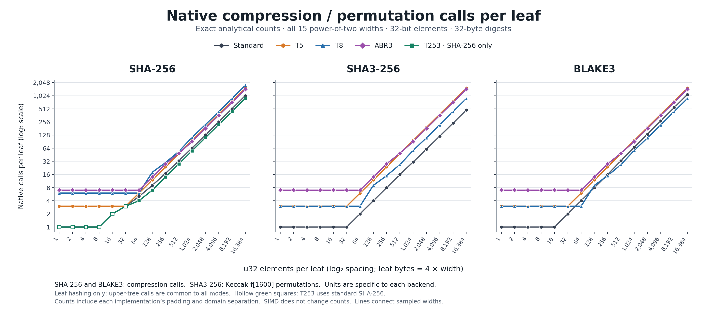
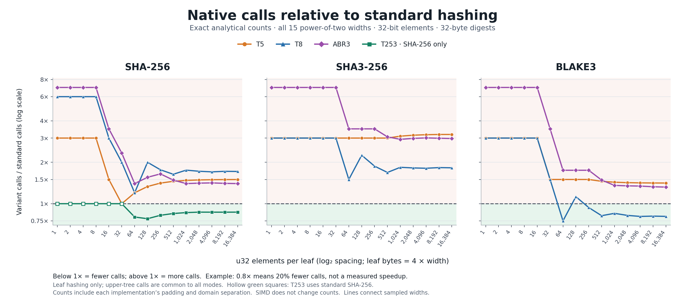

# Exact native compression counts

These are deterministic analytical counts from the Rust LeafPlan API,
not elapsed timings. All 15 power-of-two leaf widths from 1 to 16,384
u32 elements are included; one element occupies four bytes.

The ratio is variant calls / standard calls: below 1 means fewer calls.
SHA-256 and BLAKE3 count native compressions; SHA3-256 counts Keccak-f[1600]
permutations. Comparing these units across different hash functions does
not compare execution time. SIMD and parallel scheduling do not change
the counts. Padding and the current domain-separated adapters are included.

T253 exists only for SHA-256. Hollow green markers denote its standard
SHA-256 fallback below 253 bytes. ABR3 is the implemented height-three
gadget, chained inside whole-record leaves.

For L leaves, total commitment calls are L × leaf_calls + L − 1.
Verification of one complete leaf uses leaf_calls + log₂(L).
The upper binary tree is identical in all modes and is excluded from
the plotted per-leaf counts.

- [Full 195-row data, including differences and percentages](../compression-counts.csv)
- [Native counts, SVG](native-calls.svg)
- [Relative counts, SVG](relative-calls.svg)
- [Construction and adapter definitions](../../EXPERIMENTS.md)

## Exact counts at every plotted width

### SHA-256

| u32 / leaf | Bytes / leaf | Standard | T5 | T8 | ABR3 | T253 |
| ---: | ---: | ---: | ---: | ---: | ---: | ---: |
| 1 | 4 | 1 | 3 | 6 | 7 | 1 |
| 2 | 8 | 1 | 3 | 6 | 7 | 1 |
| 4 | 16 | 1 | 3 | 6 | 7 | 1 |
| 8 | 32 | 1 | 3 | 6 | 7 | 1 |
| 16 | 64 | 2 | 3 | 6 | 7 | 2 |
| 32 | 128 | 3 | 3 | 6 | 7 | 3 |
| 64 | 256 | 5 | 6 | 6 | 7 | 4 |
| 128 | 512 | 9 | 12 | 18 | 14 | 7 |
| 256 | 1,024 | 17 | 24 | 30 | 28 | 14 |
| 512 | 2,048 | 33 | 48 | 54 | 49 | 28 |
| 1,024 | 4,096 | 65 | 96 | 114 | 91 | 56 |
| 2,048 | 8,192 | 129 | 192 | 222 | 182 | 112 |
| 4,096 | 16,384 | 257 | 384 | 438 | 364 | 223 |
| 8,192 | 32,768 | 513 | 768 | 882 | 721 | 445 |
| 16,384 | 65,536 | 1,025 | 1,536 | 1,758 | 1,435 | 890 |

### SHA3-256

| u32 / leaf | Bytes / leaf | Standard | T5 | T8 | ABR3 |
| ---: | ---: | ---: | ---: | ---: | ---: |
| 1 | 4 | 1 | 3 | 3 | 7 |
| 2 | 8 | 1 | 3 | 3 | 7 |
| 4 | 16 | 1 | 3 | 3 | 7 |
| 8 | 32 | 1 | 3 | 3 | 7 |
| 16 | 64 | 1 | 3 | 3 | 7 |
| 32 | 128 | 1 | 3 | 3 | 7 |
| 64 | 256 | 2 | 6 | 3 | 7 |
| 128 | 512 | 4 | 12 | 9 | 14 |
| 256 | 1,024 | 8 | 24 | 15 | 28 |
| 512 | 2,048 | 16 | 48 | 27 | 49 |
| 1,024 | 4,096 | 31 | 96 | 57 | 91 |
| 2,048 | 8,192 | 61 | 192 | 111 | 182 |
| 4,096 | 16,384 | 121 | 384 | 219 | 364 |
| 8,192 | 32,768 | 241 | 768 | 441 | 721 |
| 16,384 | 65,536 | 482 | 1,536 | 879 | 1,435 |

### BLAKE3

| u32 / leaf | Bytes / leaf | Standard | T5 | T8 | ABR3 |
| ---: | ---: | ---: | ---: | ---: | ---: |
| 1 | 4 | 1 | 3 | 3 | 7 |
| 2 | 8 | 1 | 3 | 3 | 7 |
| 4 | 16 | 1 | 3 | 3 | 7 |
| 8 | 32 | 1 | 3 | 3 | 7 |
| 16 | 64 | 1 | 3 | 3 | 7 |
| 32 | 128 | 2 | 3 | 3 | 7 |
| 64 | 256 | 4 | 6 | 3 | 7 |
| 128 | 512 | 8 | 12 | 9 | 14 |
| 256 | 1,024 | 16 | 24 | 15 | 28 |
| 512 | 2,048 | 33 | 48 | 27 | 49 |
| 1,024 | 4,096 | 67 | 96 | 57 | 91 |
| 2,048 | 8,192 | 135 | 192 | 111 | 182 |
| 4,096 | 16,384 | 271 | 384 | 219 | 364 |
| 8,192 | 32,768 | 543 | 768 | 441 | 721 |
| 16,384 | 65,536 | 1,087 | 1,536 | 879 | 1,435 |

## Reproduction

From the repository root:

    cargo run --locked --offline --manifest-path impl/Cargo.toml --example compression_counts > impl/results/compression-counts.csv
    uv run impl/scripts/plot_compression_counts.py

The plot script validates the complete hash/width/mode grid, standard
references, differences and ratios before rendering. It requires
Matplotlib 3.10.9. No timing benchmark is run.
