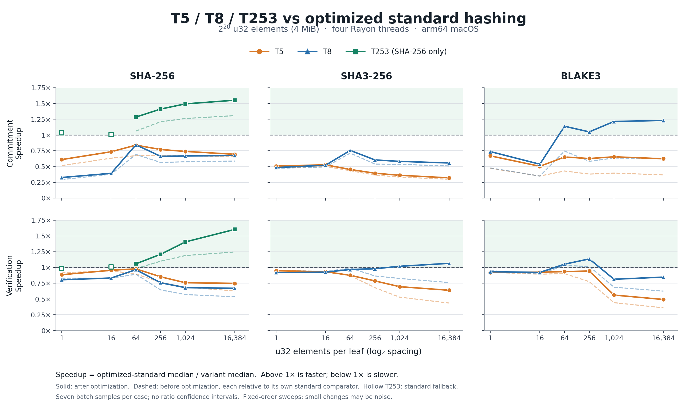

# Experimental leaf optimizations: before and after



Speedup is `optimized standard median / experimental variant median`. Above
1× means faster than optimized standard hashing. Solid curves use the final
implementation; faint dashed curves show the previous implementation, with
each run using its own standard reference.

- [N20 comparison, SVG](vs-optimized-n20.svg).
- [N26 comparison, PNG](vs-optimized-n26.png) /
  [SVG](vs-optimized-n26.svg). This sweep includes T5, T8 and SHA-256 T253.
- [Implementation speedup, PNG](implementation-speedup-n20.png) /
  [SVG](implementation-speedup-n20.svg): `before variant / after variant`.
  This answers how much this optimization pass improved each implementation;
  it does not imply that a variant beats standard hashing.
- [Exact plotted ratios](newpass-ratios.csv), with original median timings.

Data: `../newpass-before.csv`, `../newpass-after.csv` and
`../newpass-scaling.csv`. The before and after N20 sweeps each cover 2^20 u32
elements and widths 1, 16, 64, 256, 1024 and 16384. Scaling uses 2^26 elements
and widths 256 and 16384. All use seven batch-average samples per point,
targeting 150 ms total, four Rayon threads, and arm64 macOS. The binaries run
sequentially, with fixed order inside each sweep; small changes may reflect
thermal/frequency variation and background work. No ratio confidence intervals
are shown. Lines connect measured points only as visual guides.

Final SHA-256 and SHA3 rows come from the validated full sweep. A later
small-record BLAKE3 correction was remeasured for all BLAKE3 shapes/modes,
including the standard comparator, and those rows replace the pre-correction
BLAKE3 rows. Exact commands and per-backend binary/source hashes are in
[the metadata](../newpass-after-metadata.txt).

Hollow T253 markers denote its standard-hash fallback below 253 bytes; these
are not evidence of construction speedups. T253 is available only for SHA-256.
The current pass preserves each mode's existing digests and roots.

Reproduce from the repository root using Matplotlib 3.10.9:

```sh
uv run impl/scripts/plot_newpass.py
```

This renders checked-in data without running benchmarks. See
[the new results report](../../NEWPASS_RESULTS.md) for interpretation and
measurement details. The [previous plots](../plots/README.md) are retained as
historical results.
