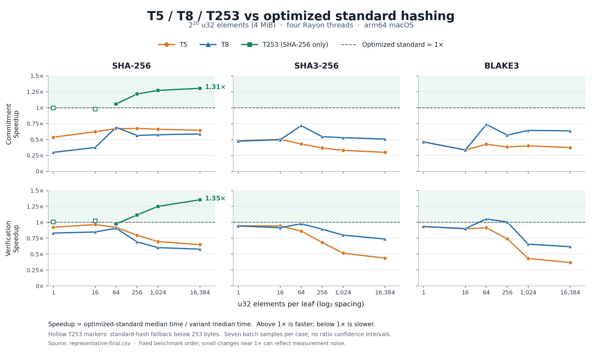

# Improvement over the optimized standard tree



The denominator is the `standard` optimized tree, not the older `baseline`
Plonky3 adaptation. Speedup is `standard median_ns / variant median_ns`.
Above 1× is faster; below 1× is slower. A 1.3× speedup corresponds to about
23% less time, not 30% less time.

- [Main figure, SVG](improvement-vs-optimized-n20.svg): all measured T5/T8
  combinations and SHA-256 T253, at `2^20` elements.
- [Scaling figure, PNG](improvement-vs-optimized-n26.png) /
  [SVG](improvement-vs-optimized-n26.svg): `2^26` elements. T5 was not measured
  in this scaling sweep; no missing points are synthesized.
- [Exact plotted ratios](improvement-ratios.csv), including latency reduction
  percentages and original median timings.

Source data: `../representative-final.csv` and `../scaling-final.csv`. These
are seven-sample median measurements on arm64 macOS with four Rayon threads.
Lines connect measured points only as visual guides. No interpolation is added
to the CSV. Figures do not show ratio confidence intervals; small differences
around 1× may be noise. The longer Criterion results remain separate because
they use a different estimator and only cover selected constructions/widths.

Hollow T253 markers indicate its standard-hash fallback for leaves shorter
than 253 bytes. Those points are not evidence of a construction improvement.
T253 is available only for SHA-256.

Reproduce from the repository root with Matplotlib 3.10.9:

```sh
uv run impl/scripts/plot_improvements.py
```

The script reads the saved data and regenerates PNG, SVG and CSV outputs;
it does not rerun the benchmarks. See [RESULTS.md](../../RESULTS.md) for the
measurement protocol and implementation scope.
